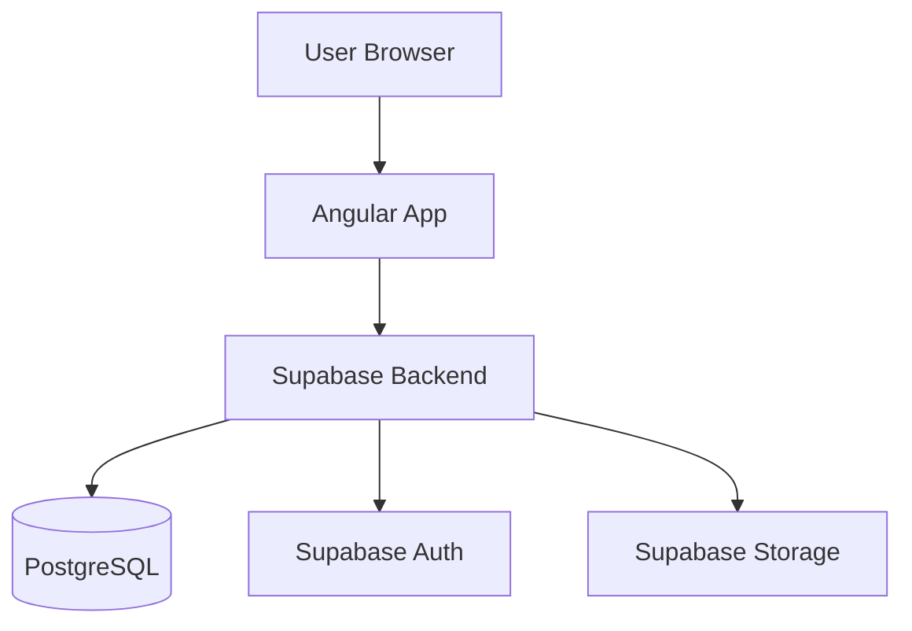

# BMAD-METHOD: Step-by-Step Guide for Existing Angular + Supabase Projects

This guide shows you how to integrate BMAD-METHOD into an ongoing Angular + Supabase project.

## Prerequisites
- Existing Angular project (any version 12+)
- Supabase backend configured
- Node.js 20+ installed

---

## Phase 1: Installation & Setup (10 minutes)

### Step 1: Install BMAD in Your Project

```bash
# Navigate to your Angular project root
cd your-angular-project

# Install BMAD
npx bmad-method install
```

**What gets created:**
- `.bmad/` - Agent definitions and tasks
- `docs/` - Documentation folder
- `.bmad-core/` - Configuration files
- `.bmad-stories/` - Development stories (created later)

### Step 2: Configure for Angular + Supabase

Edit `.bmad-core/core-config.yaml`:

```yaml
project:
  name: "Your Project Name"
  type: "fullstack"

tech-stack:
  frontend:
    framework: "Angular"
    version: "17.x"
    language: "TypeScript"
    state-management: "NgRx" # or "Services"
    ui-library: "Angular Material"

  backend:
    platform: "Supabase"
    database: "PostgreSQL"
    auth: "Supabase Auth"
    storage: "Supabase Storage"

development:
  devLoadAlwaysFiles:
    - docs/architecture.md
    - docs/coding-standards.md
```

---

## Phase 2: Document Existing Code (30-60 minutes)

### Step 3: Create PRD for Existing Features

Create `docs/prd.md` documenting what's already built:

```markdown
# Project Name - Product Requirements Document

## Project Overview
[Brief description of your app]

## Current Implementation Status

### Completed Features ✅
1. **Feature Name**
   - Description
   - Current functionality
   - Supabase tables used

2. **Another Feature**
   - Description
   - etc.

### Known Issues 🐛
- Issue 1: [description]
- Issue 2: [description]

### Planned Features 📋
- Future feature 1
- Future feature 2

## Tech Stack
- Frontend: Angular [version]
- Backend: Supabase
- UI: [Your UI library]
- State: [Your state management]

## Data Models

### Supabase Tables

#### Table: users
| Column | Type | Description |
|--------|------|-------------|
| id | uuid | Primary key |
| email | text | User email |
| role | text | admin/worker |

[Document all your tables]
```

### Step 4: Create Architecture Documentation

Create `docs/architecture.md`:

```markdown
# Architecture Document

## High-Level Architecture



## Tech Stack

| Category | Technology | Version | Purpose |
|----------|-----------|---------|---------|
| Frontend Framework | Angular | 17.x | UI Framework |
| Language | TypeScript | 5.x | Type safety |
| UI Library | Angular Material | 17.x | Components |
| State Management | NgRx | 17.x | State |
| Backend | Supabase | Latest | BaaS |
| Database | PostgreSQL | 15.x | Data storage |
| Auth | Supabase Auth | Latest | Authentication |

## Project Structure

```
src/
├── app/
│   ├── core/
│   │   ├── services/
│   │   │   ├── supabase.service.ts    # Supabase client
│   │   │   └── auth.service.ts         # Auth wrapper
│   │   ├── guards/
│   │   │   └── auth.guard.ts           # Route protection
│   │   └── interceptors/
│   ├── features/
│   │   ├── shifts/                     # Shift management
│   │   │   ├── components/
│   │   │   ├── services/
│   │   │   └── shifts.module.ts
│   │   ├── applications/               # Application management
│   │   └── check-in/                   # Check-in/out
│   ├── shared/
│   │   ├── components/
│   │   ├── models/                     # TypeScript interfaces
│   │   └── utils/
│   └── state/                          # NgRx store (if using)
├── environments/
│   ├── environment.ts
│   └── environment.prod.ts
└── assets/
```

## Supabase Integration Patterns

### Service Pattern

```typescript
// core/services/supabase.service.ts
import { Injectable } from '@angular/core';
import { createClient, SupabaseClient } from '@supabase/supabase-js';
import { environment } from '@env/environment';

@Injectable({ providedIn: 'root' })
export class SupabaseService {
  private supabase: SupabaseClient;

  constructor() {
    this.supabase = createClient(
      environment.supabaseUrl,
      environment.supabaseKey
    );
  }

  get client() {
    return this.supabase;
  }
}
```

### Feature Service Pattern

```typescript
// features/shifts/services/shift.service.ts
import { Injectable } from '@angular/core';
import { SupabaseService } from '@core/services/supabase.service';
import { Observable, from } from 'rxjs';
import { Shift } from '@shared/models/shift.model';

@Injectable({ providedIn: 'root' })
export class ShiftService {
  constructor(private supabase: SupabaseService) {}

  getShifts(): Observable<Shift[]> {
    return from(
      this.supabase.client
        .from('shifts')
        .select('*')
        .order('date', { ascending: true })
        .then(({ data, error }) => {
          if (error) throw error;
          return data as Shift[];
        })
    );
  }
}
```

## Coding Standards

### Angular Component Pattern
- Use standalone components (Angular 14+) or NgModules
- Implement OnInit, OnDestroy for lifecycle hooks
- Use ChangeDetectionStrategy.OnPush for performance
- Unsubscribe from observables in ngOnDestroy

### Supabase Patterns
- Always wrap Supabase calls in RxJS `from()`
- Handle errors with proper error handling
- Use TypeScript interfaces for type safety
- Use Supabase RLS (Row Level Security) for authorization

### State Management (if using NgRx)
- Feature-based store modules
- Use Effects for async operations
- Selectors for derived state
- Actions with clear naming

## Testing Strategy

### Component Tests
- Use TestBed for Angular component testing
- Mock Supabase services
- Test user interactions
- Verify component rendering

### Service Tests
- Mock SupabaseClient
- Test error handling
- Verify RxJS observable behavior

[Add your specific testing patterns]
```

### Step 5: Document Coding Standards

Create `docs/coding-standards.md`:

```markdown
# Coding Standards

## Critical Rules

1. **Supabase Client Access**
   - NEVER instantiate SupabaseClient directly in components
   - ALWAYS use SupabaseService singleton
   - Example: `constructor(private supabase: SupabaseService)`

2. **RxJS Observable Pattern**
   - Wrap all Supabase async calls in `from()`
   - Always unsubscribe in ngOnDestroy
   - Use `async` pipe in templates when possible

3. **TypeScript Types**
   - Define interfaces in `shared/models/`
   - Export from `shared/models/index.ts`
   - Never use `any` type

4. **Error Handling**
   - Catch Supabase errors
   - Show user-friendly messages
   - Log errors to console in dev

5. **Component Organization**
   - Smart components: Handle state, services
   - Dumb components: Display data via @Input
   - One component per file
   - Max 300 lines per component

## Naming Conventions

| Element | Convention | Example |
|---------|-----------|---------|
| Components | PascalCase + Component suffix | `ShiftListComponent` |
| Services | PascalCase + Service suffix | `ShiftService` |
| Interfaces | PascalCase | `Shift`, `Application` |
| Files | kebab-case | `shift-list.component.ts` |
| Variables | camelCase | `selectedShift` |

## Supabase Query Patterns

### Reading Data
```typescript
// ✅ Correct
getShifts(): Observable<Shift[]> {
  return from(
    this.supabase.client
      .from('shifts')
      .select('*')
      .then(({ data, error }) => {
        if (error) throw error;
        return data as Shift[];
      })
  );
}

// ❌ Wrong - no error handling
getShifts() {
  return this.supabase.client.from('shifts').select('*');
}
```

### Writing Data
```typescript
// ✅ Correct
createShift(shift: CreateShiftDto): Observable<Shift> {
  return from(
    this.supabase.client
      .from('shifts')
      .insert(shift)
      .select()
      .single()
      .then(({ data, error }) => {
        if (error) throw error;
        return data as Shift;
      })
  );
}
```

## File Organization Rules

1. Feature modules in `features/[feature-name]/`
2. Shared code in `shared/`
3. Core services in `core/services/`
4. Models in `shared/models/`

[Add your project-specific rules]
```

---

## Phase 3: Create Your First Story (15 minutes)

Now you can use BMAD to fix your current bugs or add new features!

### Step 6: Activate Scrum Master Agent

**In your IDE** (VS Code, Cursor, Windsurf, etc.):

Activate the Scrum Master agent:

```
I want to use the Scrum Master agent to create a development story
```

Then tell your AI:
```
*sm
```

This activates BMAD's Scrum Master persona.

### Step 7: Create a Story for Your Bug Fix

Tell the Scrum Master:

```
Create a story to fix the check-in/check-out button visibility issue.

Context:
- The button was working before recent updates to the Shift component
- Button should appear based on shift status and user role
- Need to check the component logic and template

Acceptance Criteria:
- Check-in button appears for accepted shifts before check-in time
- Check-out button appears after check-in
- Buttons don't appear for pending/rejected applications
- Buttons don't appear after check-out is complete
```

The Scrum Master will create `.bmad-stories/story-001-fix-checkin-button.md`:

```markdown
# Story: Fix Check-in/Check-out Button Visibility

**Status**: Draft
**Type**: Bug Fix
**Priority**: High
**Estimate**: 2 hours

## Story
As a worker, I need to see the check-in and check-out buttons at the appropriate times so I can properly log my shift attendance.

## Context
Recent updates to the Shift component broke the visibility logic for check-in/check-out buttons. The buttons should appear based on:
- Application status (must be accepted)
- Current time vs shift start/end time
- Whether check-in/check-out has already occurred

## Architecture Reference
- Component: `features/shifts/components/shift-detail/shift-detail.component.ts`
- Service: `features/shifts/services/shift.service.ts`
- Supabase table: `applications` (status, check_in_time, check_out_time)

## Tasks
- [ ] Review current button visibility logic in shift-detail component
- [ ] Check template conditional rendering (*ngIf conditions)
- [ ] Verify application status is being fetched correctly
- [ ] Add proper date/time comparison logic
- [ ] Test button visibility in different scenarios
- [ ] Add unit tests for button visibility logic

## Implementation Details

### Expected Visibility Logic

```typescript
// Check-in button should show when:
canCheckIn(): boolean {
  return this.application.status === 'accepted' &&
         !this.application.check_in_time &&
         this.isShiftStartTimeNear();
}

// Check-out button should show when:
canCheckOut(): boolean {
  return this.application.status === 'accepted' &&
         !!this.application.check_in_time &&
         !this.application.check_out_time;
}

private isShiftStartTimeNear(): boolean {
  const now = new Date();
  const shiftStart = new Date(this.shift.start_time);
  const diffMinutes = (shiftStart.getTime() - now.getTime()) / (1000 * 60);
  return diffMinutes <= 30; // Allow check-in 30min before
}
```

### Template Pattern

```html
<!-- shift-detail.component.html -->
<div class="actions">
  <button
    mat-raised-button
    color="primary"
    *ngIf="canCheckIn()"
    (click)="checkIn()">
    Check In
  </button>

  <button
    mat-raised-button
    color="accent"
    *ngIf="canCheckOut()"
    (click)="checkOut()">
    Check Out
  </button>
</div>
```

## Acceptance Criteria
- [ ] Check-in button appears only for accepted applications
- [ ] Check-in button appears 30min before shift start
- [ ] Check-out button appears only after check-in
- [ ] Buttons hidden after check-out is complete
- [ ] Buttons don't appear for pending/rejected applications
- [ ] Unit tests verify all visibility conditions

## Testing Notes
Test scenarios:
1. Application pending - no buttons
2. Application accepted, before check-in window - no buttons
3. Application accepted, within check-in window - check-in button
4. After check-in - check-out button
5. After check-out - no buttons

## Dev Agent Record
- [ ] All tasks completed
- [ ] Tests passing
- [ ] Code follows Angular + Supabase patterns from architecture.md

### Debug Log
[Dev agent will update this during implementation]

### Completion Notes
[Dev agent will add notes here]

### Change Log
- Created: 2025-10-21
```

---

## Phase 4: Implement the Story (30-60 minutes)

### Step 8: Activate Dev Agent

In your IDE AI assistant:

```
Activate the BMAD Dev agent to implement the story

*dev
```

Then say:

```
Please implement story-001-fix-checkin-button.md

The story file is at: .bmad-stories/story-001-fix-checkin-button.md
```

### Step 9: Dev Agent Works Through Story

The Dev agent will:

1. **Read the story** - Get full context
2. **Review architecture** - Load `docs/architecture.md` and `docs/coding-standards.md`
3. **Analyze current code** - Check `shift-detail.component.ts`
4. **Implement fix** - Update component logic
5. **Write tests** - Add unit tests for visibility logic
6. **Update story** - Mark tasks complete with [x]
7. **Run tests** - Execute `ng test`
8. **Mark ready for review** - Update story status

**The Dev agent follows your coding standards automatically!**

### Step 10: Review and Test

```bash
# Run tests
ng test

# Run app locally
ng serve

# Test the fix manually
# - Go to an accepted shift
# - Verify check-in button appears
# - Check in
# - Verify check-out button appears
# - Check out
# - Verify buttons disappear
```

---

## Phase 5: Use BMAD for Ongoing Development

### For New Features

**Step 1: Plan in Web UI (optional)**
- Use PM agent to add feature to PRD
- Use Architect to design feature architecture

**Step 2: Create Story**
```
*sm

Create a story for [feature name]
- Feature description
- Acceptance criteria
- Supabase tables needed
```

**Step 3: Implement**
```
*dev

Implement story-XXX-[feature-name].md
```

### For Bug Fixes (Like Your Current Bugs)

**Quick story creation:**

```
*sm

Create stories for these bugs:
1. Shift List showing expired shifts as open
2. Application List displaying wrong status for expired shifts

Context:
- Need to filter shifts by status and expiry date
- Need to update application status based on shift end time
- May need Supabase query updates or client-side filtering
```

Then implement each:

```
*dev

Implement story-002-fix-expired-shifts.md
```

### For Refactoring

```
*sm

Create story to refactor authentication service to use Supabase Auth v2 patterns

Tasks:
- Update SupabaseService to use new auth methods
- Migrate from deprecated session() to getSession()
- Update auth guards
- Test all auth flows
```

---

## Best Practices for Using BMAD in Existing Projects

### 1. Start Small
- Fix one bug with BMAD first
- Get comfortable with the workflow
- Then tackle bigger features

### 2. Keep Documentation Updated
- Update `docs/architecture.md` when adding new patterns
- Update `docs/coding-standards.md` with project-specific rules
- Keep `docs/prd.md` current with features

### 3. Story Organization
```
.bmad-stories/
├── active/
│   └── story-001-fix-checkin-button.md
├── completed/
│   └── story-XXX-completed-feature.md
└── backlog/
    └── story-YYY-future-feature.md
```

### 4. Use Stories as Documentation
- Stories become your implementation history
- Easy to review what was done and why
- Great for onboarding new developers

### 5. Leverage Context
Each story should include:
- **Context**: Why this work is needed
- **Architecture Reference**: Which files/services
- **Implementation Details**: Code patterns to follow
- **Acceptance Criteria**: Definition of done

This prevents the AI from "forgetting" your project structure!

---

## Quick Reference Commands

```bash
# Install BMAD
npx bmad-method install

# Activate agents in IDE
*sm      # Scrum Master - create stories
*dev     # Developer - implement stories
*qa      # QA - review and test
*architect  # Architect - design features

# Create story
*sm
"Create story for [feature/bug]"

# Implement story
*dev
"Implement story-XXX.md"

# Apply QA feedback
*dev
*review-qa  # Apply QA fixes from story

# Run tests
ng test
ng e2e
```

---

## Troubleshooting

### "Dev agent keeps asking what to do"
→ Make sure story has clear tasks and implementation details
→ Verify `docs/architecture.md` exists and is referenced in core-config.yaml

### "Agent doesn't follow Angular patterns"
→ Update `docs/coding-standards.md` with your specific patterns
→ Add examples of correct vs incorrect code

### "Supabase integration patterns inconsistent"
→ Document your Supabase service pattern in architecture.md
→ Add code examples to coding-standards.md

### "Tests failing after AI changes"
→ Add test examples to architecture.md
→ Specify test requirements in story acceptance criteria

---

## Example: Your Current Workflow

### Before BMAD
```
1. Identify bug in WhatsApp/team chat
2. Open component file
3. Figure out what's wrong
4. Make changes
5. Test manually
6. Hope you didn't break anything
7. Push to git
```

### With BMAD
```
1. Create story with Scrum Master
   *sm "Create story to fix check-in button visibility"

2. Story includes:
   - Full context
   - Acceptance criteria
   - Implementation details
   - Test requirements

3. Dev agent implements
   *dev "Implement story-001"
   - Reads story
   - Checks architecture docs
   - Implements fix
   - Writes tests
   - Updates story

4. Review changes
   - All tasks checked off
   - Tests passing
   - Code follows standards

5. Commit with context
   git commit -m "fix: check-in button visibility (story-001)"
```

---

## Next Steps

1. ✅ Install BMAD in your project
2. ✅ Create architecture.md documenting current code
3. ✅ Create coding-standards.md with Angular + Supabase patterns
4. ✅ Create first story for your check-in button bug
5. ✅ Use Dev agent to implement
6. ✅ Test and verify
7. ✅ Use for other bugs and new features

---

## Need Help?

- 💬 [BMAD Discord Community](https://discord.gg/gk8jAdXWmj)
- 📖 [BMAD User Guide](../user-guide.md)
- 🏗️ [Architecture Guide](../core-architecture.md)
- 🐛 [Report Issues](https://github.com/bmadcode/bmad-method/issues)

---

**You're now ready to use BMAD-METHOD in your existing Angular + Supabase project!** 🚀
