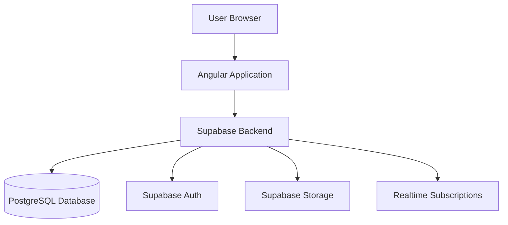

# BMAD-METHOD Installation Guide

## Quick Installation for Angular + Supabase Projects

This guide will help you install and configure BMAD-METHOD in your existing Angular + Supabase project.

---

## Step 1: Install BMAD

### Navigate to Your Project

```bash
cd /Users/javeedishaq/devwork/crunch-projects/nurselife/nurselife-admin
```

### Run the Installer

```bash
npx bmad-method install
```

### When Prompted for Project Path

Enter your **full absolute project path**:

```
/Users/javeedishaq/devwork/crunch-projects/nurselife/nurselife-admin
```

**Don't use the default npm cache path!**

### Select Installation Type

When asked, choose: **IDE Installation** (for development)

---

## Step 2: Verify Installation

After installation completes, verify these folders were created:

```bash
ls -la .bmad/
ls -la docs/
ls -la .bmad-core/
```

You should see:
- `.bmad/agents/` - AI agent definitions
- `.bmad/tasks/` - Workflow tasks
- `docs/` - Documentation folder
- `.bmad-core/core-config.yaml` - Configuration file

---

## Step 3: Configure for Angular + Supabase

Edit `.bmad-core/core-config.yaml`:

```yaml
project:
  name: "NurseLife Admin Panel"
  type: "fullstack"
  description: "Shift management system for nurses"

tech-stack:
  frontend:
    framework: "Angular"
    version: "17.x"  # Update to your version
    language: "TypeScript"
    state-management: "NgRx"  # or "Services" or "Signals"
    ui-library: "Angular Material"  # or your UI library

  backend:
    platform: "Supabase"
    database: "PostgreSQL"
    auth: "Supabase Auth"
    storage: "Supabase Storage"
    realtime: "Supabase Realtime"

development:
  devLoadAlwaysFiles:
    - docs/architecture.md
    - docs/coding-standards.md
```

---

## Step 4: Create Documentation Files

### Create `docs/prd.md` - Product Requirements

```markdown
# NurseLife Admin Panel - Product Requirements Document

## Project Overview
Web admin panel for managing nursing shifts, applications, and worker check-ins/check-outs.

## Current Status

### Completed Features ✅
1. **Shift Management (Admin)**
   - Create shifts with date/time, location, requirements
   - View all shifts (upcoming, ongoing, completed)
   - Edit and cancel shifts
   - Supabase table: `shifts`

2. **Application Management**
   - Workers apply for shifts
   - View application status (pending, accepted, rejected)
   - Supabase table: `applications`

3. **Check-in/Check-out**
   - Workers check in when shift starts
   - Workers check out when shift ends
   - Track attendance timestamps
   - Columns: `check_in_time`, `check_out_time`

### Known Issues 🐛
1. Check-in/Check-out button not appearing after recent Shift component updates
2. Shift List showing expired shifts as open
3. Application List displaying pending status for expired shifts

### Planned Features 📋
- [Add your planned features here]

## Tech Stack
- **Frontend**: Angular 17+ with TypeScript
- **Backend**: Supabase (PostgreSQL + Auth + Realtime)
- **UI**: Angular Material / Tailwind CSS
- **State**: NgRx / RxJS Services

## User Roles
1. **Admin**: Create shifts, review applications, manage system
2. **Worker/Nurse**: Browse shifts, apply, check-in/out

## Data Models

### Supabase Tables

#### shifts
| Column | Type | Description |
|--------|------|-------------|
| id | uuid | Primary key |
| admin_id | uuid | Creator admin |
| date | date | Shift date |
| start_time | timestamp | Shift start |
| end_time | timestamp | Shift end |
| location | text | Shift location |
| status | text | open/filled/cancelled |
| created_at | timestamp | Creation time |

#### applications
| Column | Type | Description |
|--------|------|-------------|
| id | uuid | Primary key |
| shift_id | uuid | Related shift |
| worker_id | uuid | Applicant |
| status | text | pending/accepted/rejected |
| check_in_time | timestamp | Check-in timestamp |
| check_out_time | timestamp | Check-out timestamp |
| applied_at | timestamp | Application time |

[Add other tables as needed]
```

### Create `docs/architecture.md` - Architecture Document

```markdown
# NurseLife Admin Panel - Architecture Document

## High-Level Architecture



## Tech Stack

| Category | Technology | Version | Purpose |
|----------|-----------|---------|---------|
| Frontend Framework | Angular | 17.x | UI Framework |
| Language | TypeScript | 5.x | Type safety |
| UI Library | Angular Material | 17.x | UI Components |
| State Management | NgRx | 17.x | Application state |
| Backend | Supabase | Latest | Backend as a Service |
| Database | PostgreSQL | 15.x | Data storage |
| Auth | Supabase Auth | Latest | Authentication |
| Realtime | Supabase Realtime | Latest | Live updates |

## Project Structure

```
src/
├── app/
│   ├── core/
│   │   ├── services/
│   │   │   ├── supabase.service.ts      # Supabase client
│   │   │   ├── auth.service.ts          # Auth wrapper
│   │   │   └── storage.service.ts       # Storage wrapper
│   │   ├── guards/
│   │   │   ├── auth.guard.ts            # Route protection
│   │   │   └── role.guard.ts            # Role-based access
│   │   ├── interceptors/
│   │   │   └── error.interceptor.ts     # Global error handling
│   │   └── models/
│   │       ├── shift.model.ts
│   │       ├── application.model.ts
│   │       └── user.model.ts
│   ├── features/
│   │   ├── shifts/                      # Shift management
│   │   │   ├── components/
│   │   │   │   ├── shift-list/
│   │   │   │   ├── shift-detail/
│   │   │   │   └── shift-form/
│   │   │   ├── services/
│   │   │   │   └── shift.service.ts
│   │   │   └── shifts.module.ts
│   │   ├── applications/                # Application management
│   │   │   ├── components/
│   │   │   ├── services/
│   │   │   └── applications.module.ts
│   │   └── check-in/                    # Check-in/out
│   │       ├── components/
│   │       ├── services/
│   │       └── check-in.module.ts
│   ├── shared/
│   │   ├── components/
│   │   │   ├── navbar/
│   │   │   └── footer/
│   │   ├── pipes/
│   │   └── utils/
│   └── state/                           # NgRx store (if using)
│       ├── actions/
│       ├── reducers/
│       ├── effects/
│       └── selectors/
├── environments/
│   ├── environment.ts
│   └── environment.prod.ts
└── assets/
```

## Supabase Integration Patterns

### 1. Supabase Service (Singleton)

```typescript
// core/services/supabase.service.ts
import { Injectable } from '@angular/core';
import { createClient, SupabaseClient } from '@supabase/supabase-js';
import { environment } from '@env/environment';

@Injectable({ providedIn: 'root' })
export class SupabaseService {
  private supabase: SupabaseClient;

  constructor() {
    this.supabase = createClient(
      environment.supabaseUrl,
      environment.supabaseKey
    );
  }

  get client(): SupabaseClient {
    return this.supabase;
  }

  get auth() {
    return this.supabase.auth;
  }

  get storage() {
    return this.supabase.storage;
  }
}
```

### 2. Feature Service Pattern

```typescript
// features/shifts/services/shift.service.ts
import { Injectable } from '@angular/core';
import { SupabaseService } from '@core/services/supabase.service';
import { Observable, from } from 'rxjs';
import { map } from 'rxjs/operators';
import { Shift } from '@core/models/shift.model';

@Injectable({ providedIn: 'root' })
export class ShiftService {
  constructor(private supabase: SupabaseService) {}

  getShifts(): Observable<Shift[]> {
    return from(
      this.supabase.client
        .from('shifts')
        .select('*')
        .order('date', { ascending: true })
    ).pipe(
      map(({ data, error }) => {
        if (error) throw error;
        return data as Shift[];
      })
    );
  }

  createShift(shift: Partial<Shift>): Observable<Shift> {
    return from(
      this.supabase.client
        .from('shifts')
        .insert(shift)
        .select()
        .single()
    ).pipe(
      map(({ data, error }) => {
        if (error) throw error;
        return data as Shift;
      })
    );
  }

  updateShift(id: string, updates: Partial<Shift>): Observable<Shift> {
    return from(
      this.supabase.client
        .from('shifts')
        .update(updates)
        .eq('id', id)
        .select()
        .single()
    ).pipe(
      map(({ data, error }) => {
        if (error) throw error;
        return data as Shift;
      })
    );
  }
}
```

### 3. Authentication Pattern

```typescript
// core/services/auth.service.ts
import { Injectable } from '@angular/core';
import { SupabaseService } from './supabase.service';
import { Observable, from } from 'rxjs';
import { map } from 'rxjs/operators';

@Injectable({ providedIn: 'root' })
export class AuthService {
  constructor(private supabase: SupabaseService) {}

  signIn(email: string, password: string): Observable<any> {
    return from(
      this.supabase.auth.signInWithPassword({ email, password })
    ).pipe(
      map(({ data, error }) => {
        if (error) throw error;
        return data;
      })
    );
  }

  signOut(): Observable<void> {
    return from(this.supabase.auth.signOut()).pipe(
      map(({ error }) => {
        if (error) throw error;
      })
    );
  }

  getCurrentUser(): Observable<any> {
    return from(this.supabase.auth.getUser()).pipe(
      map(({ data, error }) => {
        if (error) throw error;
        return data.user;
      })
    );
  }
}
```

## Component Patterns

### Smart Component Example

```typescript
// features/shifts/components/shift-list/shift-list.component.ts
import { Component, OnInit, OnDestroy } from '@angular/core';
import { ShiftService } from '../../services/shift.service';
import { Shift } from '@core/models/shift.model';
import { Subject } from 'rxjs';
import { takeUntil } from 'rxjs/operators';

@Component({
  selector: 'app-shift-list',
  templateUrl: './shift-list.component.html',
  styleUrls: ['./shift-list.component.scss']
})
export class ShiftListComponent implements OnInit, OnDestroy {
  shifts: Shift[] = [];
  loading = false;
  private destroy$ = new Subject<void>();

  constructor(private shiftService: ShiftService) {}

  ngOnInit(): void {
    this.loadShifts();
  }

  ngOnDestroy(): void {
    this.destroy$.next();
    this.destroy$.complete();
  }

  loadShifts(): void {
    this.loading = true;
    this.shiftService.getShifts()
      .pipe(takeUntil(this.destroy$))
      .subscribe({
        next: (shifts) => {
          this.shifts = shifts;
          this.loading = false;
        },
        error: (error) => {
          console.error('Error loading shifts:', error);
          this.loading = false;
        }
      });
  }
}
```

## Routing Architecture

```typescript
// app-routing.module.ts
const routes: Routes = [
  {
    path: '',
    redirectTo: '/dashboard',
    pathMatch: 'full'
  },
  {
    path: 'login',
    loadChildren: () => import('./auth/auth.module').then(m => m.AuthModule)
  },
  {
    path: 'dashboard',
    canActivate: [AuthGuard],
    loadChildren: () => import('./dashboard/dashboard.module').then(m => m.DashboardModule)
  },
  {
    path: 'shifts',
    canActivate: [AuthGuard],
    loadChildren: () => import('./features/shifts/shifts.module').then(m => m.ShiftsModule)
  },
  {
    path: 'applications',
    canActivate: [AuthGuard],
    loadChildren: () => import('./features/applications/applications.module').then(m => m.ApplicationsModule)
  }
];
```

## Environment Configuration

```typescript
// environments/environment.ts
export const environment = {
  production: false,
  supabaseUrl: 'YOUR_SUPABASE_URL',
  supabaseKey: 'YOUR_SUPABASE_ANON_KEY'
};
```

## Testing Strategy

### Unit Tests
- Test services with mocked SupabaseClient
- Test components with mocked services
- Use Jasmine/Karma or Jest

### Integration Tests
- Test component + service integration
- Mock Supabase responses

### E2E Tests
- Test critical user flows
- Use Cypress or Playwright

## Error Handling

```typescript
// Global error interceptor
@Injectable()
export class ErrorInterceptor implements HttpInterceptor {
  intercept(req: HttpRequest<any>, next: HttpHandler): Observable<HttpEvent<any>> {
    return next.handle(req).pipe(
      catchError((error) => {
        // Handle Supabase errors
        if (error.error?.message) {
          // Show user-friendly message
          this.snackBar.open(error.error.message, 'Close', { duration: 3000 });
        }
        return throwError(() => error);
      })
    );
  }
}
```

## Performance Optimization

1. **Lazy Loading**: Load feature modules on demand
2. **OnPush Change Detection**: Use for performance
3. **Supabase Indexes**: Add indexes to frequently queried columns
4. **Pagination**: Implement for large lists
5. **Caching**: Cache frequently accessed data

## Security

1. **Row Level Security (RLS)**: Enable on all Supabase tables
2. **Auth Guards**: Protect routes
3. **Role-based Access**: Implement role guards
4. **Input Validation**: Validate all user inputs
5. **Environment Variables**: Never commit secrets
```

### Create `docs/coding-standards.md` - Coding Standards

```markdown
# NurseLife Admin - Coding Standards

## Critical Rules

### 1. Supabase Client Access
- ✅ **ALWAYS** use `SupabaseService` singleton
- ❌ **NEVER** instantiate `createClient()` directly in components
- ✅ Inject via constructor: `constructor(private supabase: SupabaseService)`

### 2. RxJS Observable Patterns
- ✅ **ALWAYS** wrap Supabase promises in `from()`
- ✅ **ALWAYS** unsubscribe in `ngOnDestroy()`
- ✅ Use `takeUntil(destroy$)` pattern
- ✅ Prefer `async` pipe in templates when possible

```typescript
// ✅ CORRECT
export class MyComponent implements OnDestroy {
  private destroy$ = new Subject<void>();

  ngOnInit() {
    this.service.getData()
      .pipe(takeUntil(this.destroy$))
      .subscribe(data => this.data = data);
  }

  ngOnDestroy() {
    this.destroy$.next();
    this.destroy$.complete();
  }
}

// ❌ WRONG - Memory leak
export class MyComponent {
  ngOnInit() {
    this.service.getData().subscribe(data => this.data = data);
  }
}
```

### 3. TypeScript Type Safety
- ✅ Define interfaces in `core/models/`
- ✅ Export from barrel file: `core/models/index.ts`
- ❌ **NEVER** use `any` type
- ✅ Use strict TypeScript mode

```typescript
// ✅ CORRECT
export interface Shift {
  id: string;
  date: string;
  start_time: string;
  end_time: string;
  location: string;
  status: 'open' | 'filled' | 'cancelled';
}

// ❌ WRONG
const shift: any = { ... };
```

### 4. Error Handling
- ✅ **ALWAYS** handle Supabase errors
- ✅ Show user-friendly error messages
- ✅ Log errors to console in development

```typescript
// ✅ CORRECT
this.shiftService.getShifts().subscribe({
  next: (shifts) => this.shifts = shifts,
  error: (error) => {
    console.error('Failed to load shifts:', error);
    this.snackBar.open('Failed to load shifts. Please try again.', 'Close');
  }
});

// ❌ WRONG - Silent failure
this.shiftService.getShifts().subscribe(shifts => this.shifts = shifts);
```

### 5. Component Organization
- ✅ Smart components: Handle state and services
- ✅ Presentational components: Display data via `@Input()`
- ✅ One component per file
- ✅ Max 300 lines per component (refactor if larger)
- ✅ Use `ChangeDetectionStrategy.OnPush` for performance

## Naming Conventions

| Element | Convention | Example |
|---------|-----------|---------|
| Components | PascalCase + Component | `ShiftListComponent` |
| Services | PascalCase + Service | `ShiftService` |
| Interfaces/Models | PascalCase | `Shift`, `Application` |
| Files | kebab-case | `shift-list.component.ts` |
| Variables | camelCase | `selectedShift`, `isLoading` |
| Constants | UPPER_SNAKE_CASE | `MAX_SHIFTS`, `API_URL` |
| Private members | Prefix with _ | `_subscription`, `_data` |

## File Organization

```
feature-name/
├── components/
│   ├── feature-list/
│   │   ├── feature-list.component.ts
│   │   ├── feature-list.component.html
│   │   ├── feature-list.component.scss
│   │   └── feature-list.component.spec.ts
│   └── feature-detail/
├── services/
│   ├── feature.service.ts
│   └── feature.service.spec.ts
└── feature.module.ts
```

## Supabase Query Patterns

### Reading Data

```typescript
// ✅ CORRECT - With error handling
getShifts(): Observable<Shift[]> {
  return from(
    this.supabase.client
      .from('shifts')
      .select('*')
      .order('date', { ascending: true })
  ).pipe(
    map(({ data, error }) => {
      if (error) throw error;
      return data as Shift[];
    })
  );
}

// ❌ WRONG - No error handling
getShifts() {
  return this.supabase.client.from('shifts').select('*');
}
```

### Writing Data

```typescript
// ✅ CORRECT
createShift(shift: Partial<Shift>): Observable<Shift> {
  return from(
    this.supabase.client
      .from('shifts')
      .insert(shift)
      .select()
      .single()
  ).pipe(
    map(({ data, error }) => {
      if (error) throw error;
      return data as Shift;
    })
  );
}
```

### Updating Data

```typescript
// ✅ CORRECT
updateShift(id: string, updates: Partial<Shift>): Observable<Shift> {
  return from(
    this.supabase.client
      .from('shifts')
      .update(updates)
      .eq('id', id)
      .select()
      .single()
  ).pipe(
    map(({ data, error }) => {
      if (error) throw error;
      return data as Shift;
    })
  );
}
```

### Deleting Data

```typescript
// ✅ CORRECT
deleteShift(id: string): Observable<void> {
  return from(
    this.supabase.client
      .from('shifts')
      .delete()
      .eq('id', id)
  ).pipe(
    map(({ error }) => {
      if (error) throw error;
    })
  );
}
```

## Authentication Patterns

```typescript
// ✅ CORRECT - Route guard
@Injectable({ providedIn: 'root' })
export class AuthGuard implements CanActivate {
  constructor(
    private auth: AuthService,
    private router: Router
  ) {}

  canActivate(): Observable<boolean> {
    return this.auth.getCurrentUser().pipe(
      map(user => {
        if (user) return true;
        this.router.navigate(['/login']);
        return false;
      }),
      catchError(() => {
        this.router.navigate(['/login']);
        return of(false);
      })
    );
  }
}
```

## Testing Standards

### Component Tests

```typescript
describe('ShiftListComponent', () => {
  let component: ShiftListComponent;
  let fixture: ComponentFixture<ShiftListComponent>;
  let mockShiftService: jasmine.SpyObj<ShiftService>;

  beforeEach(() => {
    mockShiftService = jasmine.createSpyObj('ShiftService', ['getShifts']);

    TestBed.configureTestingModule({
      declarations: [ShiftListComponent],
      providers: [
        { provide: ShiftService, useValue: mockShiftService }
      ]
    });

    fixture = TestBed.createComponent(ShiftListComponent);
    component = fixture.componentInstance;
  });

  it('should load shifts on init', () => {
    const mockShifts: Shift[] = [/* mock data */];
    mockShiftService.getShifts.and.returnValue(of(mockShifts));

    component.ngOnInit();

    expect(component.shifts).toEqual(mockShifts);
    expect(mockShiftService.getShifts).toHaveBeenCalled();
  });
});
```

## Git Commit Messages

Use conventional commits:

```
feat: add check-in/check-out functionality
fix: resolve button visibility issue
docs: update architecture documentation
test: add unit tests for ShiftService
refactor: simplify shift status logic
style: format code with prettier
```

## Code Review Checklist

Before marking a story as complete:

- [ ] All TypeScript errors resolved
- [ ] No `any` types used
- [ ] Error handling implemented
- [ ] Observables properly unsubscribed
- [ ] Unit tests written and passing
- [ ] Code follows naming conventions
- [ ] No console.logs in production code
- [ ] Components use OnPush when possible
- [ ] Supabase queries optimized
- [ ] User-friendly error messages shown
```

---

## Step 5: Create Your First Story

Now you're ready to use BMAD! Let's fix your check-in button bug.

### In Your IDE (VS Code, Cursor, Windsurf)

Activate BMAD Scrum Master:

```
I want to use BMAD Scrum Master to create a development story

*sm
```

### Create Bug Fix Story

Tell the Scrum Master:

```
Create a story to fix the check-in/check-out button visibility issue

Context:
- Button was working before recent updates to Shift component
- Should display based on application status and shift timing
- Component location: features/shifts/components/shift-detail/

Tasks:
- Review current button visibility logic in component
- Check template *ngIf conditions
- Verify application status is fetched correctly
- Add proper date/time comparison for shift window
- Test button visibility in all scenarios
- Add unit tests for visibility methods

Acceptance Criteria:
- Check-in button shows for accepted applications 30min before shift start
- Check-out button shows only after check-in is complete
- No buttons appear for pending/rejected applications
- No buttons appear after check-out is complete
- All edge cases tested
```

The Scrum Master will create: `.bmad-stories/story-001-fix-checkin-button.md`

---

## Step 6: Implement with Dev Agent

Activate the Dev agent:

```
Activate BMAD Dev agent

*dev
```

Then tell it:

```
Implement story-001-fix-checkin-button.md

Story location: .bmad-stories/story-001-fix-checkin-button.md
```

The Dev agent will:
1. Read the story
2. Load architecture and coding standards
3. Analyze your component code
4. Fix the visibility logic
5. Write unit tests
6. Run tests
7. Mark story complete

---

## Step 7: Test and Verify

```bash
# Run unit tests
ng test

# Run the app
ng serve

# Manual testing:
# 1. Go to an accepted shift
# 2. Verify check-in button appears
# 3. Click check-in
# 4. Verify check-out button appears
# 5. Click check-out
# 6. Verify buttons disappear
```

---

## Quick Reference: BMAD Commands

```bash
# Activate Scrum Master (create stories)
*sm

# Activate Developer (implement stories)
*dev

# Activate QA (review and test)
*qa

# Show help for current agent
*help

# Exit current agent
*exit
```

---

## Troubleshooting

### Issue: "Dev agent doesn't know my coding patterns"
**Solution**: Update `docs/coding-standards.md` with specific examples

### Issue: "Story doesn't have enough context"
**Solution**: Add more details to architecture.md and reference in story

### Issue: "Tests failing after AI changes"
**Solution**: Add test examples to coding-standards.md

### Issue: "Agent asks too many questions"
**Solution**: Ensure story has clear tasks and acceptance criteria

---

## Next Steps

1. ✅ Install BMAD
2. ✅ Configure for Angular + Supabase
3. ✅ Create documentation files
4. ✅ Fix check-in button bug with BMAD
5. ✅ Fix other bugs (expired shifts, application status)
6. ✅ Use BMAD for new features

---

## Resources

- 📖 [BMAD User Guide](https://github.com/bmadcode/bmad-method/blob/main/docs/user-guide.md)
- 🏗️ [Architecture Guide](https://github.com/bmadcode/bmad-method/blob/main/docs/core-architecture.md)
- 💬 [Discord Community](https://discord.gg/gk8jAdXWmj)
- 🐛 [Report Issues](https://github.com/bmadcode/bmad-method/issues)

---

## Tips for Success

1. **Start Small**: Fix one bug first to learn the workflow
2. **Keep Docs Updated**: Update architecture.md as you add patterns
3. **Clear Stories**: More context = better implementation
4. **Review Changes**: Always review what the Dev agent changed
5. **Commit Stories**: Track story files in git for history

---

**You're ready to use BMAD-METHOD in your NurseLife Admin project!** 🚀
